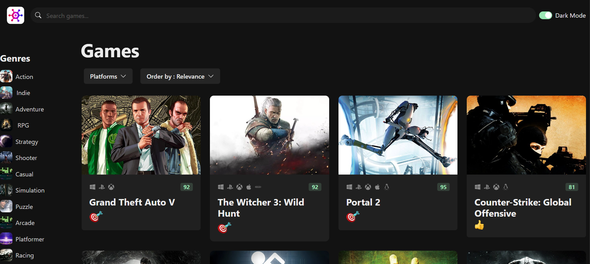

# GameHub 

GameHub is a video game discovery web app that helps you find new and interesting games to play. With GameHub, you can
search for games by platform, genre, and more.

## React + Typescript + Vite

### Overview

## Getting Started

To get started with GameHub, follow these steps:

1. Clone this repository to your local machine.
2. Run `yarn install` to install the required dependencies.
3. Get a RAWG API key at https://rawg.io/apidocs. You'll have to create an account first.
4. Add the API key to **src/services/api-client.ts**
5. Run `yarn dev` to start the web server.

